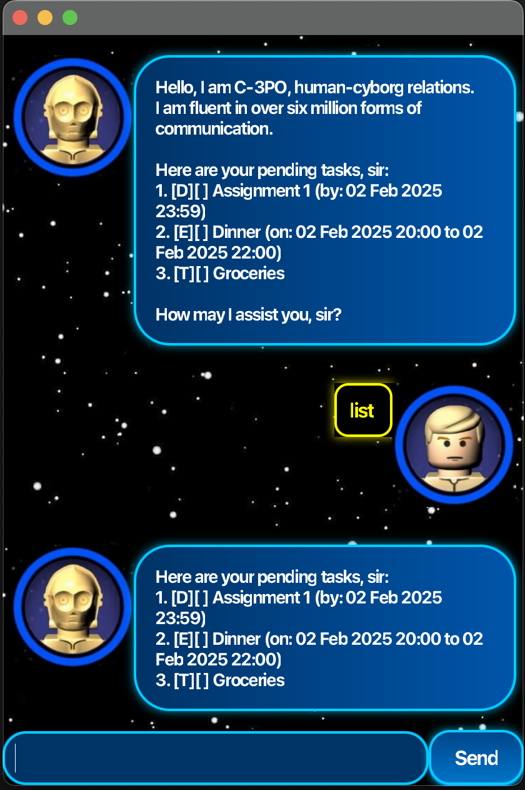

# C3PO User Guide



Welcome to C3PO, a personal chatbot to help you manage your tasks.

## Features

This application allows you to manage tasks with various features:

### Adding Tasks

#### Todo

```txt
todo <description>
```

Creates a basic task with the given description. Use this feature to add simple tasks to your list.

#### Deadline

```txt
deadline <description> /by <yyyy-mm-dd hh:MM>
```

Creates a task with a specific deadline. The date and time must be provided using the `/by` command in the format `yyyy-mm-dd hh:MM`.

#### Event

```txt
event <description> /from <yyyy-mm-dd hh:MM> /to <yyyy-mm-dd hh:MM>
```

Creates a task with a start and end date. Specify the start date and time using the `/from` command and the end date and time using the `/to` command, both in the format `yyyy-mm-dd hh:MM`.

### Managing Tasks

#### Mark

```txt
mark <number>
```

Marks the task identified by the specified number as done. This helps you keep track of completed tasks.

#### Unmark

```txt
unmark <number>
```

Unmarks the task identified by the specified number as not done. Use this feature to revert a task to its incomplete state.

#### Delete

```txt
delete <number>
```

Deletes the task identified by the specified number. Use this feature to remove tasks from your list.

### Searching and Viewing Tasks

#### Find

```txt
find <keywords...>
```

Searches for tasks that match all the specified keywords. This helps you quickly locate specific tasks.

#### List

```txt
list
```

Displays all the tasks in your list. Use this feature to view all your tasks at a glance.

### Exiting the Application

#### Bye

```txt
bye
```

Exits the application and saves all tasks to storage. Use this feature to safely close the application.
